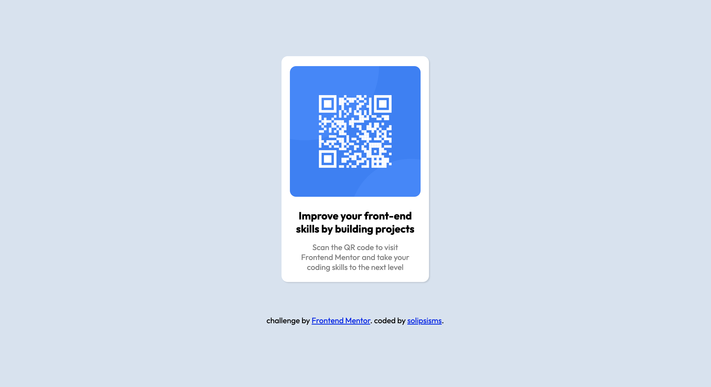

# Frontend Mentor - QR code component solution

This is a solution to the [QR code component challenge on Frontend Mentor](https://www.frontendmentor.io/challenges/qr-code-component-iux_sIO_H). Frontend Mentor challenges help you improve your coding skills by building realistic projects. 

## Table of contents

- [Overview](#overview)
  - [Screenshot](#screenshot)
  - [Links](#links)
- [My process](#my-process)
  - [Built with](#built-with)
  - [What I learned](#what-i-learned)
  - [Continued development](#continued-development)
  - [Useful resources](#useful-resources)
- [Author](#author)
- [Acknowledgments](#acknowledgments)

## Overview

### Screenshot

### Links

[Solution URL](https://github.come/solipsisms/qrcode)

[Live Site URL](https://solipsisms.github.io/qrcode/)

## My process

Since I haven't had much experience with actually putting my HTML and CSS knowledge together, it was a lot of changing things around and seeing how it would change. I found a live server extension on VS Code that was super useful. If I wasn't sure if something was actually possible or not, I would Google it.

### Built with

-HTML

-CSS

-Flexbox

### What I learned

I learned the capabilites of CSS can really enahnce your HTML to a whole other level. I have built a lot of websites with just HTML running a Python script in the past, but I have never focused on the more aesthetic side. This project wasn't easy, but it makes me feel excited for the true capabilites in web-developemnt.

### Continued development

I really want to go back at this code and figure out what each line is doing. I feel like my organization skills here were not that great, as I was trying to figure everything out all at once. 

### Useful resources

https://www.w3schools.com/ was a HUGE resource for me. It has a lot of basic information, very helpful in my limited experience with CSS.

## Author

me, solipsisms

my [frontend mentor profile](https://www.frontendmentor.io/home)

## Acknowledgments

Arekkusu17's code was what turned my whole project around. I didn't know what Flexboxes were and it helped me with the alignment of everything so much.
